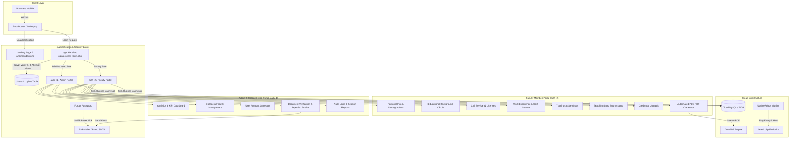

# 🎓 Pamantasan ng Lungsod ng Pasig - Faculty Profiling System

[](https://www.php.net/)
[](https://www.mysql.com/)
[](https://render.com)
[](https://tidbcloud.com)
[](https://uptimerobot.com)
[](https://github.com/dompdf/dompdf)
[](https://github.com/PHPMailer/PHPMailer)

A full-stack, enterprise-grade **Faculty Profiling and Document Management System** designed for **Pamantasan ng Lungsod ng Pasig (PLP)**. This platform centralizes faculty credential tracking, civil service eligibility, academic background, teaching loads, automated CSC Form 212 (Personal Data Sheet) PDF generation, and multi-tier administrative approval workflows.

---

## 📑 Table of Contents

- [System Architecture](#-system-architecture)
- [Role-Based Feature Matrix](#-role-based-feature-matrix)
- [Tech Stack](#-tech-stack)
- [Database Schema & Architecture](#-database-schema--architecture)
- [Cloud Deployment Guide (100% Free)](#-cloud-deployment-guide-100-free)
  - [Step 1: Setup Free Cloud Database (TiDB Cloud)](#step-1-setup-free-cloud-database-tidb-cloud)
  - [Step 2: Deploy Web Service to Render](#step-2-deploy-web-service-to-render)
  - [Step 3: Keep-Alive 24/7 with UptimeRobot](#step-3-keep-alive-247-with-uptimerobot)
- [Alternative Deployments (Vercel)](#-alternative-deployments)
- [Local Development Setup](#-local-development-setup)
- [Default Demo Credentials](#-default-demo-credentials)
- [Environment Variables Reference](#-environment-variables-reference)
- [Troubleshooting & FAQ](#-troubleshooting--faq)

---

## 🏗 System Architecture



---

## 🌟 Role-Based Feature Matrix

### 1. 🛡️ Administrator & College Head Portal (`auth_1/`)
- **Executive Analytics Dashboard**: Real-time breakdown of total faculty, active/inactive ratios, employment classifications (Full-Time vs. Part-Time), and college distributions.
- **College & Faculty Directory**: College-level filtering, faculty profile modal, accreditation details, and dynamic status toggling.
- **User Account Management**: Add user accounts, generate secure random passwords, reset faculty credentials, and dispatch automated notification emails.
- **Document Verification Workflow**: View, verify, or reject uploaded documents (PDS, SALN, TOR, Diploma, Teaching Loads, Certificates, Evaluations) with mandatory rejection reasons emailed to faculty.
- **Audit Logging & Activity Reports**: Complete tracking of IP addresses, login timestamps, user-agents, and session durations with export options (CSV & PDF).

### 2. 👨‍🏫 Faculty Member Portal (`auth_2/`)
- **CSC Personal Data Sheet (PDS) Form 212 Builder**:
  - Personal Information, Contact, Government IDs (GSIS, Pag-IBIG, PhilHealth, SSS, TIN), and Demographics.
  - Educational Background (Elementary to Graduate Studies).
  - Civil Service Eligibilities, Licensures, and Board Exam ratings.
  - Work Experience & Government Service history.
  - Training Programs, Seminars, and Workshops attended.
- **1-Click Official PDS PDF Export**: DomPDF integration that converts digital faculty profiles into official, formatted PDS PDF documents ready for download.
- **Document Credentials Vault**: Upload and track verification status (`Pending`, `Verified`, `Rejected`) with feedback notes from administrators.
- **Teaching Load Submission**: Submit regular load units, overload units, academic terms, and attach verified syllabus/load schedules.
- **Account Settings & Themes**: Update passwords and switch between Dark/Light visual modes.

---

## 💻 Tech Stack

| Component | Technology | Purpose |
| :--- | :--- | :--- |
| **Backend Language** | PHP 8.0 - 8.3 | Core server-side application logic & APIs |
| **Web Server** | Apache 2.4 (Docker) | HTTP server with `mod_rewrite` & `mod_headers` |
| **Database** | MySQL 8.0+ / MariaDB / TiDB | Relational database with Foreign Keys & Views |
| **PDF Generation** | DomPDF v3.1 | Automated CSC Form 212 PDS generation |
| **Email Delivery** | PHPMailer v6.10 + Brevo SMTP | Password reset & credential rejection notices |
| **Frontend UI** | HTML5, CSS3, JavaScript (ES6) | Responsive dashboards and interactive modals |
| **Icons & Fonts** | FontAwesome 6, Google Fonts | Interface iconography and typography |
| **Monitoring** | UptimeRobot | 24/7 Keep-alive ping to prevent container sleep |
| **Containerization** | Docker (`php:8.2-apache`) | Standardized production runtime |

---

## 🗄 Database Schema & Architecture

The database consists of **11 core relational tables** and **2 optimized views**:

| Table / View | Description | Key Relationships |
| :--- | :--- | :--- |
| `colleges` | Academic colleges/departments | Primary key `college_id` referenced by `faculty` & `users` |
| `faculty` | Faculty master records | Keyed by `faculty_id`, linked to `colleges` |
| `users` | Authentication accounts & roles | Linked to `faculty_id` (Faculty) or `college_id` (Admin/Head) |
| `faculty_personal_info`| Demographic and government ID data | 1-to-1 extension of `faculty` table |
| `academic_background` | Education history from elementary to grad | 1-to-Many linked to `faculty_id` |
| `civil_service_eligibility` | Board exams and civil service ratings | 1-to-Many linked to `faculty_id` |
| `credentials` | Uploaded document files and verification state | 1-to-Many linked to `faculty_id` |
| `teaching_load` | Semester workload units & PDF attachments | 1-to-Many linked to `faculty_id` |
| `training_programs` | Seminars, workshops, and training logs | 1-to-Many linked to `faculty_id` |
| `work_experience` | Employment history and government service flag| 1-to-Many linked to `faculty_id` |
| `user_logins` | Security audit trail (IP, timestamps, browser)| Linked to `users` & `colleges` |
| `vw_credentials_report`| Unified view of pending credentials & loads | Aggregated view for Admin review dashboard |
| `vw_faculty_users` | View joining faculty details with login accounts | Quick user directory reference |

---

## 🚀 Cloud Deployment Guide (100% Free)

Deploying the system online takes **under 10 minutes** using **TiDB Cloud (Free MySQL)**, **Render (Web Service)**, and **UptimeRobot (Keep-Alive)**.

```
┌─────────────────┐       ┌─────────────────┐       ┌─────────────────┐
│   TiDB Cloud    │ ◄───► │  Render Docker  │ ◄───► │   UptimeRobot   │
│  (Free MySQL)   │       │  (PHP 8.2 App)  │       │ (24/7 KeepAlive)│
└─────────────────┘       └─────────────────┘       └─────────────────┘
```

---

### Step 1: Setup Free Cloud Database (TiDB Cloud)

1. Sign up for free at [tidbcloud.com](https://tidbcloud.com) (No credit card required).
2. Click **Create Cluster** and choose **Serverless** (Free 5GB forever).
3. Choose your preferred region (e.g., `Singapore` or `US East`).
4. Once created, click **SQL Editor** in the left sidebar.
5. Open [`cloud_schema.sql`](cloud_schema.sql) in this repository, copy the entire SQL content, paste it into the TiDB SQL Editor, and click **Run**.
6. Click **Connect** on the TiDB dashboard and note your credentials:
   - `Host` (e.g., `gateway01.ap-southeast-1.prod.aws.tidbcloud.com`)
   - `Port` (`4000`)
   - `User` (e.g., `xxxxxx.root`)
   - `Password` (Your generated password)
   - `Database` (`test` or `finalproj`)

---

### Step 2: Deploy Web Service to Render

1. Fork or push this repository to your **GitHub** account.
2. Sign in to [render.com](https://render.com).
3. Click **New +** > **Web Service**.
4. Select **Build and deploy from a Git repository** and pick your `Faculty-Profiling-System` repo.
5. Configure the service:
   - **Name**: `faculty-profiling-system`
   - **Language / Environment**: `Docker`
   - **Region**: Choose the region closest to your database (e.g., `Singapore` or `Oregon`).
   - **Branch**: `main` (or `master`)
   - **Instance Type**: `Free`
6. Scroll down to **Environment Variables** and add:

| Key | Value / Example | Notes |
| :--- | :--- | :--- |
| `DB_HOST` | `gateway01.ap-southeast-1.prod.aws.tidbcloud.com` | From TiDB Connect screen |
| `DB_PORT` | `4000` | TiDB default port |
| `DB_USER` | `xxxxxx.root` | TiDB database username |
| `DB_PASSWORD` | `your_tidb_password` | TiDB database password |
| `DB_NAME` | `test` (or `finalproj`) | Database name where schema was run |
| `SMTP_HOST` | `smtp-relay.brevo.com` | SMTP Server (or Gmail/SendGrid) |
| `SMTP_PORT` | `587` | SMTP Port |
| `SMTP_USER` | `your_smtp_user` | SMTP Username |
| `SMTP_PASS` | `your_smtp_password` | SMTP Password / App Key |
| `SMTP_FROM_EMAIL` | `plp.no.reply1@gmail.com` | Sender email address |

7. Click **Deploy Web Service**. Render will automatically build the Docker container, install Composer dependencies, set permissions, and start the app!
8. When deployment finishes, your app will be live at `https://<your-app-name>.onrender.com`.

---

### Step 3: Keep-Alive 24/7 with UptimeRobot

Render free-tier web services sleep after 15 minutes of inactivity. **UptimeRobot** pings your app every 5 minutes to ensure it **stays awake 24/7 with zero cold starts**.

1. Create a free account at [uptimerobot.com](https://uptimerobot.com).
2. Click **+ Add New Monitor**.
3. Fill in the monitor settings:
   - **Monitor Type**: `HTTP(s)`
   - **Friendly Name**: `PLP Faculty Profiling System`
   - **URL (or IP)**: `https://<your-app-name>.onrender.com/health.php`
   - **Monitoring Interval**: `Every 5 minutes`
   - **Monitor Timeout**: `30 seconds`
4. Click **Create Monitor**.
5. ✅ Your Render service is now monitored and will remain **active 24/7**!

---

## 🔄 Alternative Deployments

### Vercel (Serverless PHP)
A pre-configured [`vercel.json`](vercel.json) is included in the root directory. To deploy on Vercel:
1. Install Vercel CLI: `npm i -g vercel`.
2. Run `vercel` in the project root.
3. Configure environment variables in the Vercel Dashboard under **Project Settings > Environment Variables**.

---

## 💻 Local Development Setup

### Prerequisites
- [XAMPP](https://www.apachefriends.org/) (PHP 8.0+ and MySQL) or native PHP + MySQL.
- [Composer](https://getcomposer.org/)

### Quick Start
1. Clone the repository into your web server directory (`htdocs` for XAMPP):
   ```bash
   git clone https://github.com/kurtfajutagana/Faculty-Profiling-System.git
   cd Faculty-Profiling-System
   ```
2. Install PHP dependencies:
   ```bash
   composer install
   ```
3. Create database in phpMyAdmin:
   - Open `http://localhost/phpmyadmin`
   - Create a new database named `finalproj`
   - Import [`cloud_schema.sql`](cloud_schema.sql) (or `faculty_profiling_system.sql`).
4. Start Apache & MySQL in XAMPP.
5. Open your browser and navigate to:
   ```
   http://localhost/Faculty-Profiling-System/
   ```

---

## 🔑 Default Demo Credentials

| Role | College | Username | Password |
| :--- | :--- | :--- | :--- |
| **Admin** | College of Computer Studies | `ccs_admin` | `Password123` |
| **Admin** | College of Arts and Science | `cas_admin` | `Password123` |
| **Admin** | College of Engineering | `coe_admin` | `Password123` |
| **Head** | College of Computer Studies | `ccs_head` | `Password123` |
| **Faculty** | College of Computer Studies | `23-20000` | `Password123` |
| **Faculty** | College of Arts and Science | `23-00001` | `Password123` |

*(Note: In production, administrators should immediately change default passwords under Settings).*

---

## ⚙️ Environment Variables Reference

| Variable | Type | Default | Description |
| :--- | :--- | :--- | :--- |
| `DB_HOST` | String | `localhost` | Database server hostname |
| `DB_PORT` | Integer | `3306` (or `4000`) | Database server port |
| `DB_USER` | String | `root` | Database username |
| `DB_PASSWORD` | String | `""` | Database user password |
| `DB_NAME` | String | `finalproj` | Target database name |
| `DATABASE_URL`| String | *(None)* | Optional full MySQL connection URL |
| `DB_SSL_CA` | String | *(None)* | Optional path to SSL CA certificate |
| `SMTP_HOST` | String | `smtp-relay.brevo.com` | SMTP host for emails |
| `SMTP_PORT` | Integer | `587` | SMTP port (587 for TLS, 465 for SSL)|
| `SMTP_USER` | String | *(Brevo default)* | SMTP authentication username |
| `SMTP_PASS` | String | *(Brevo default)* | SMTP authentication password |
| `SMTP_SECURE`| String | `tls` | SMTP security protocol (`tls` or `ssl`)|
| `SMTP_FROM_EMAIL`| String| `plp.no.reply1@gmail.com` | Default sender email |
| `SMTP_FROM_NAME` | String| `PLP Faculty Portal` | Display name in outgoing emails |

---

## ❓ Troubleshooting & FAQ

### 1. `Unknown database 'finalproj'` during Cloud Import
- **Solution**: Use [`cloud_schema.sql`](cloud_schema.sql). It does not contain hardcoded `USE finalproj;` statements and works directly inside whichever database name your cloud provider created (such as `test` or `finalproj`).

### 2. PDF Personal Data Sheet (PDS) fails to generate
- **Solution**: Ensure the PHP extensions `mbstring`, `dom`, and `gd` are enabled. If running in Docker or Render, these are automatically configured in the provided `Dockerfile`.

### 3. File upload errors on Render
- **Solution**: The `Dockerfile` automatically creates the upload directories and grants `775` permissions to `www-data`. Ensure uploaded files are within the 5MB size limit.

### 4. How do I verify the Keep-Alive is working?
- Navigate to `https://<your-app>.onrender.com/health.php` in your browser. You should receive a JSON response:
  ```json
  {
      "status": "healthy",
      "service": "PLP Faculty Profiling System",
      "uptime_monitor": "ready",
      "database": "connected"
  }
  ```

---

## 📄 License
Developed for **Pamantasan ng Lungsod ng Pasig (PLP)**. All rights reserved.
